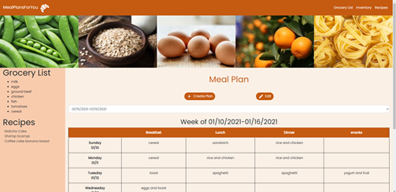
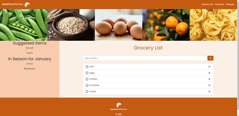
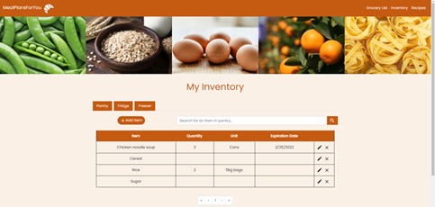
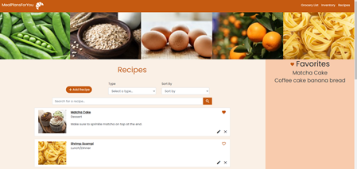

# Meal Planner
A web application created with the MERN stack written in JavaScript where a user can keep track of weekly meal plans, a grocery list, food inventory items, and recipes all in one place for easy access.
## Description
This project consists of four main components: meal plans, grocery list, food inventory, and recipes.

### Home page (meal plan)
A user can create and edit weekly meal plans that start with Sunday and end with Saturday. When the page loads, the current week is displayed if there is a meal plan already created for that week. There is a dropdown option to choose the meal plan week to display. The meal plan entry has a row for each day of the week and a breakfast, lunch, dinner, and snacks column. The home page contains a side bar which displays the grocery list and favorited recipes.

### Grocery list page
Items can be added in the add item bar and the grocery items will be displayed below. There is an option to delete the item or check the item. The side bar contains suggested items to buy and in-season items based on the current month. (Note: This information is hardcoded, see Future Work section below).

### Inventory page
A user can keep track of a food inventory which is divided into a pantry, fridge, and freezer section. For each section, an item can be added which includes a name field, quantity field (required), unit field, and expiration date field. There is also the option to update or delete the item. A search bar allows for an item to be searched by name. There is also a pagination feature.

### Recipes page
In this section, a recipe can be added with the following fields: name of recipe (required), url link to recipe website, file if recipe is in a file, recipe image, recipe type (required), and additional notes. For each recipe, there is an option to update, delete, or favorite it. If the recipe is favorited, it will show up in the side bar. Recipes can be filtered by type (All, breakfast, lunch/dinner, dessert, snack, side dish, other) and sorted by recipe name, type, or favorites. A search bar allows for a recipe to be searched by name. There is also a pagination feature.

## Dependencies/Technologies Used
### Main Technologies
* MongoDB: v4.4.0
* Express.js: v4.17.1
* React: v16.13.1
* Node.js: v12.18.3
* Bootstrap: v4.5.0
* Redux: v4.0.5

*See package.json and package.json in the client folder for a comprehensive list of dependencies and their versions.*

## Future Work
* Apply machine learning principles to create a recommender system for the grocery list section for suggested items to buy and for the recipe section for suggested recipes to try (based on current recipes, meal plan entries, and current inventory items).
* Use more API's to incorporate more features for meal planning such as food nutrition facts, calorie tracker, and in-season foods for the grocery list section.
* Highlight food items in the inventory that are about to expire and implement sort by feature.
* Implement login/sign up account feature.

## Sources
* Initial project setup and layout based on the "Learn The MERN Stack" YouTube playlist by Traversy Media. https://www.youtube.com/watch?v=PBTYxXADG_k&list=PLillGF-RfqbbiTGgA77tGO426V3hRF9iE
* Images in the screenshots come from Microsoft PowerPoint stock images
